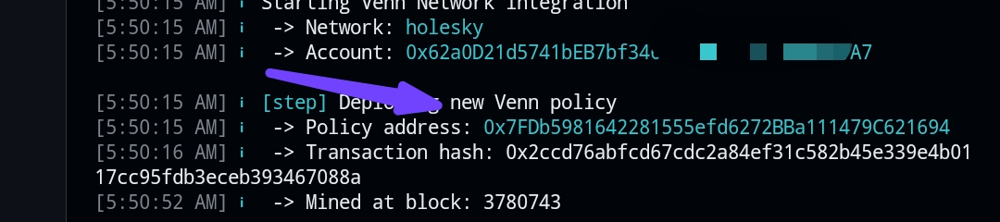

# Venn

This project demonstrates how to deploy a smart contract to the Venn Testnet (Holesky) with firewall protection using the Venn Firewall SDK (`@ironblocks/firewall-consumer`) and integrate the Venn DApp SDK (`@vennbuild/venn-dapp-sdk`) to approve transactions in a frontend. The contract (`Rare`) includes a simple contract.
## Prerequisites

- **Node.js and npm**: Install Node.js (v16 or later) and npm on your local machine:
  - **Windows/macOS/Linux**: Download from [nodejs.org](https://nodejs.org).
- **Hardhat**: This project uses Hardhat for smart contract development.
- **MetaMask**: A wallet with Holesky ETH for deployment and testing (request from [holesky-faucet.com](https://holesky-faucet.com)).
- **Git**: To clone the repository.
- **Terminal**: Use a terminal like Command Prompt (Windows), Terminal (macOS/Linux).
## Steps

### 1. Clone the Repository
Open a terminal and clone the repository:
```bash
git clone https://github.com/Wizbisy/Venn.git
cd Venn
```
### 2. installing dependencies
run
```bash
npm install
npm i -g @vennbuild/cli
```
### 3. updating environment variables (.env)
open the .env file and update with your own variables 
```bash
VENN_PRIVATE_KEY=your_metamask_private_key
API_URL=https://ethereum-holesky-rpc.publicnode.com
VENN_NODE_URL=https://signer2.testnet.venn.build/api/17000/sign
VENN_POLICY_ADDRESS=your_policy_address
```
VENN_PRIVATE_KEY; Your metamask private key containing holesky eth.
VENN_POLICY_ADDRESS: Your policy address gotten after registering your smart contract with venn in step 6

### 4. compile the smart contract 
run
```bash
npx hardhat compile
```
 you should see something just like this 
### 5. Deploy the smart contract 
Deploy the contract to Holesky testnet.
```bash
npx hardhat run scripts/deploy.js --network holesky
```
Get your smart contract and update the `venn.config.json` file with your actual smart contract.

### 6. Register with Venn cli 
after updating the `venn.config.json` file run 
```bash
venn enable --network holesky
```
then get your POLICY ADDRESS from your terminal  and update the `.env` and `venn.config.json` file.

### 7. Setup Dapp SDK.
after updating the `.env` and `venn.config.json` file Use the Venn DApp SDK to approve transactions before sending them on-chain 
```bash
npx hardhat run scripts/approve-tx.js --network holesky
```
now head to the [galxe task](https://app.galxe.com/quest/nj4xyZSwmKCysKVriKTCi6/GCg8NtpjAD) amd verify to claim the points.
